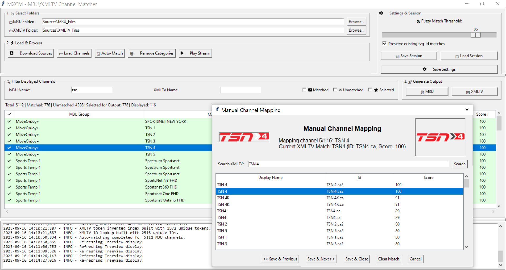

# MXCM - M3U/XMLTV Channel Matcher 🎛️📺

A powerful and flexible tool for matching channels from M3U playlists with electronic program guide (EPG) data from XMLTV files. It features a user-friendly graphical interface for manual adjustments and a robust command-line interface for complete automation.


<p align="center">

</p>

## ✨ Features

-   **🖥️ Dual Mode Operation**: Use the full-featured Graphical User Interface (GUI) for interactive matching or the command-line (headless) mode for automation and scripting.
-   **🤖 Intelligent Auto-Matching**: Utilizes fuzzy logic to automatically find the best EPG match for each channel in your M3U file.
-   **📝 Manual Override**: Easily override automatic matches, find a match for an unmatched channel, or clear an incorrect match through the intuitive interface.
-   **🎚️ Adjustable Fuzzy Threshold**: Fine-tune the sensitivity of the auto-matcher on-the-fly using a simple slider.
-   **🌐 Source Downloader**: Automatically download the latest M3U and XMLTV files from a list of URLs defined in `sources.json`.
-   **💾 Session Management**: Save your matching progress to a session file and load it later to continue your work.
-   **📤 Output Generation**: Creates new, clean M3U and XMLTV files containing only your selected, matched channels.
-   **🔎 Powerful Filtering & Sorting**: Quickly find channels by name or status (matched, unmatched, selected) and sort by any column.
-   **🗂️ Category Management**: Remove entire groups/categories of channels from your M3U playlist with a few clicks.
-   **▶️ Stream Testing**: Instantly test a channel's stream by opening it in your default media player (e.g., VLC).


## ⚙️ Configuration

The application uses two external files for configuration:

### `matcher_app_config.ini` 📝

This file stores the primary settings for the application. If it doesn't exist, it will be created with default values when you save your settings in the GUI.

```ini
[Paths]
m3u_folder = C:\Path\To\Your\M3U_Files
xmltv_folder = C:\Path\To\Your\XMLTV_Files
output_m3u_folder = Sources\Output
output_xmltv_folder = Sources\Output

[Settings]
fuzzy_threshold = 85
player_path = vlc
```

-   `m3u_folder`: The directory where your M3U files are located and/or will be downloaded.
-   `xmltv_folder`: The directory where your XMLTV files are located and/or will be downloaded.
-   `output_m3u_folder`: The output directory where your M3U files are saved.
-   `output_xmltv_folder`: The output directory where your XMLTV files are saved.
-   `fuzzy_threshold`: The default matching score (0-100) required to consider a channel "matched".
-   `player_path`: The command to launch your media player (e.g., `vlc`, `C:\Program Files\VLC\vlc.exe`).

### `sources.json` 🌐

This file tells the downloader *what* to download. It's a simple list of URLs for your M3U and EPG files.

```json
{
    "M3U": [
        "http://example.com/my_playlist.m3u"
    ],
    "EPG": [
        "https://example.com/my_guide.xml.gz",
        "C:\\Users\\YourUser\\Desktop\\local_guide.xml"
    ]
}
```
*Note: You can use both web URLs and local file paths.*

## 🏁 Usage

**Workflow:**
1.  **📂 Set Folders**: Use the "Browse..." buttons to select your M3U and XMLTV folders.
2.  **⬇️ Download (Optional)**: Click "Download Sources from JSON" to fetch the latest files. You'll be asked if you want to clean the destination folders first.
3.  **📥 Load & Match**: Click "Load Channels from Folders". The app will parse all files and perform an initial auto-match.
4.  **🔍 Review & Adjust**:
    -   Use the filter and sort options to inspect the matches.
    -   Adjust the "Fuzzy Match Threshold" slider to see how it affects the automatic selections (`✓`/`✗`).
    -   Double-click any channel to open the **Manual Match** dialog.
    -   Click the checkbox (`✓`/`✗`) to manually include or exclude a channel from the final output.
5.  **💾 Generate Files**: Once you are satisfied, click "Generate M3U File" and "Generate XMLTV File" to save your results.

### Command-Line (Headless) Mode 🖥️💻

You can also use command-line arguments for automation. The app will run without a GUI and perform all actions sequentially.

To see all available options, run:
```
MXMM.exe --help
```

**Examples:**

**1. Full Automation:** Clean destination folders, download new sources, match with a threshold of 85, and generate new output files.
```
MXMM.exe --download --clean-folders --threshold 85 --output-m3u "MyChannels.m3u" --output-xmltv "MyGuide.xml.gz"
```

**2. Process Local Files:** Match existing files from specific folders and generate the output.
```
MXMM.exe --m3u-folder "C:\M3U" --xmltv-folder "C:\XMLTV" --output-m3u "matched.m3u" --output-xmltv "guide.xml"
```

**3. Quick Update:** Download sources (overwriting old ones) and generate new files using the settings from `matcher_app_config.ini`.
```
MXMM.exe --download --output-m3u "playlist.m3u" --output-xmltv "epg.xml.gz"
```

## 📄 License

This project is licensed under the MIT License.
